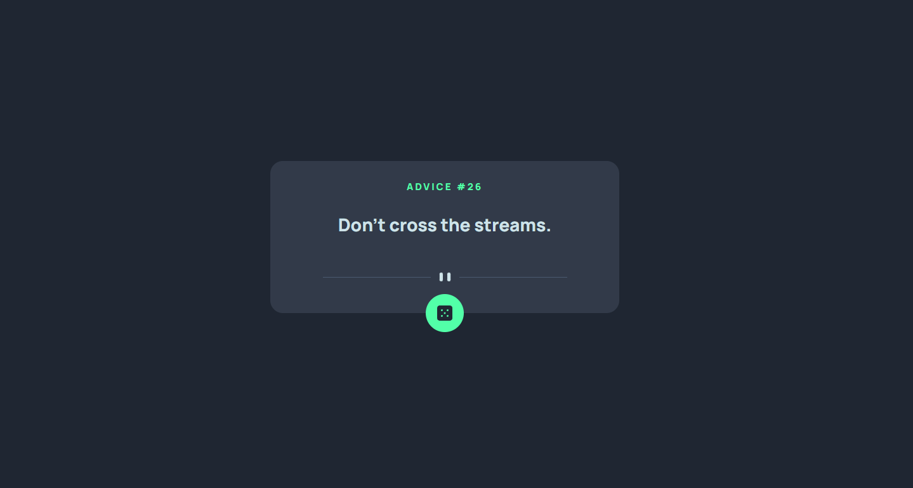

# Frontend Mentor - Advice generator app solution

This is a solution to the [Advice generator app challenge on Frontend Mentor](https://www.frontendmentor.io/challenges/advice-generator-app-QdUG-13db). Frontend Mentor challenges help you improve your coding skills by building realistic projects.

## Table of contents

- [Overview](#overview)
  - [The challenge](#the-challenge)
  - [Screenshot](#screenshot)
  - [Links](#links)
- [My process](#my-process)
  - [Built with](#built-with)
  - [What I learned](#what-i-learned)
  - [Continued development](#continued-development)
  - [Useful resources](#useful-resources)
- [Author](#author)

## Overview

### The challenge

Users should be able to:

- View the optimal layout for the app depending on their device's screen size
- See hover states for all interactive elements on the page
- Generate a new piece of advice by clicking the dice icon

### Screenshot



### Link

- Live Site URL: [](https://paulcostin.github.io/advice-generator-app/)

## My process

### Built with

- Semantic HTML5 markup
- CSS custom properties
- Flexbox
- Mobile-first workflow

### What I learned

Really loved how I learned to use css variables and how easy it is to change variables and how quickly you can get the desired effect.
Also I really liked the fetch part of using the advice API. Should really do some more projects using API`s.

Really proud of the following snippets:

```css
:root {
  /* colors */
  --clr-light-cyan: hsl(193, 38%, 86%);
  --clr-neon-green: hsl(150, 100%, 66%);
  --clr-grayish-blue: hsl(217, 19%, 38%);
  --clr-dark-grayish-blue: hsl(217, 19%, 24%);
  --clr-dark-blue: hsl(218, 23%, 16%);

  /* font-family */
  --ff-manrope: "Manrope", sans-serif;

  /* font-size */
  --fs-28: 28px;
  --fs-20: 20px;
  --fs-15: 15px;

  /* font-weight */
  --fw-800: 800;
  --fw-400: 400;
}
```

```js
fetch("https://api.adviceslip.com/advice")
  .then((response) => {
    return response.json();
  })
  .then((adviceData) => {
    const AdviceObject = adviceData.slip;
    adviceNr.innerHTML = AdviceObject.id;
    adviceText.innerHTML = AdviceObject.advice;
  })
  .catch((error) => {
    console.log(error);
  });
```

### Continued development

In the future, I want to focus more on building website using API`s as I feel like it really transforms a website from being static to being a bit more dynamic.
As I used arrow functions in JS, I feel like I should practice more this part of javascript.

### Useful resources

- [YouTube](https://www.youtube.com/watch?v=2AfzKmgqWUE&t=608s&ab_channel=OstonCodeCypher) - Came across this video when I searched on how to do the fetch request. Really came in handy as the guy that explains it got straight to the point and also showed examples on how to do the fetch request.

## Author

- Name - [Costin Paul Razvan]
- Frontend Mentor - [@Rooneyfull](https://www.frontendmentor.io/profile/Rooneyfull)
